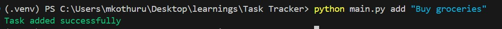
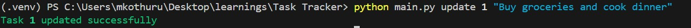
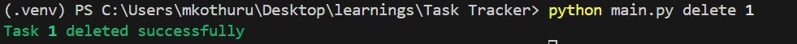
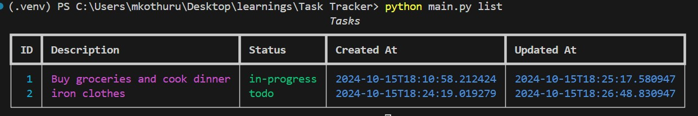

# Task Tracker CLI

Build a CLI app to track your tasks and manage your to-do list.

Start building, submit solution and get feedback from the community.

## Features

Task tracker is a project used to track and manage your tasks. In this task, you will build a simple command line interface (CLI) to track what you need to do, what you have done, and what you are currently working on. This project will help you practice your programming skills, including working with the filesystem, handling user inputs, and building a simple CLI application.

## Requirements

The application should run from the command line, accept user actions and inputs as arguments, and store the tasks in a JSON file. The user should be able to:

- Add, Update, and Delete tasks
- Mark a task as in progress or done
- List all tasks
- List all tasks that are done
- List all tasks that are not done
- List all tasks that are in progress


## Example

The list of commands and their usage is given below:

```sh
# Adding a new task
python main.py add "Buy groceries"
# Output: Task added successfully (ID: 1)

# Updating and deleting tasks
python main.py update 1 "Buy groceries and cook dinner"
python main.py delete 1

# Marking a task as in progress or done
python main.py mark-in-progress 1
python main.py mark-done 1

# Listing all tasks
python main.py list

# Listing tasks by status
python main.py list done
python main.py list todo
python main.py list in-progress
```
## Task Properties

Each task should have the following properties:

- **id**: A unique identifier for the task
- **description**: A short description of the task
- **status**: The status of the task (todo, in-progress, done)
- **createdAt**: The date and time when the task was created
- **updatedAt**: The date and time when the task was last updated

Make sure to add these properties to the JSON file when adding a new task and update them when updating a task.

## Getting Started

Here are a few steps to help you get started with the Task Tracker CLI project:

### Set Up Your Development Environment

- Ensure you have Python installed on your system.
- Install a code editor or IDE (e.g., VSCode, PyCharm).
- Install `typer` for building the CLI and `sqlite3` for the database.

### Project Initialization

- Create a new project directory for your Task Tracker CLI.
- Initialize a Git repository to manage your project.

### Implementing Features

- Start by creating a basic CLI structure using `typer` to handle user inputs.
- Implement each feature one by one, ensuring to test thoroughly before moving to the next (e.g., implement adding task functionality first, listing next, then updating, marking as in progress, etc.).
- Use SQLite to store tasks in a database instead of a JSON file.

### Testing and Debugging

- Test each feature thoroughly to ensure it works as expected.
- Use print statements or a debugger to help identify and fix issues.

### Running the Application

To run the application, use the following command:

For example, to add a new task:

```sh
python main.py add "Buy groceries"
```

## Output

### Output

The `output` folder contains screenshots demonstrating the usage of the Task Tracker CLI application. Below are the explanations for each screenshot:

1. **Adding a New Task**

    
    - This screenshot shows the command to add a new task and the confirmation message indicating the task was added successfully.

2. **Updating a Task**

    
    - This screenshot demonstrates updating an existing task with a new description.

3. **Deleting a Task**

    
    - This screenshot captures the command to delete a task and the confirmation message.

4. **Marking a Task as In Progress**

    
    - This screenshot shows how to mark a task as in progress.

5. **Marking a Task as Done**

    
    - This screenshot illustrates marking a task as done.

6. **Listing All Tasks**

    
    - This screenshot displays the command to list all tasks and the resulting output.

7. **Listing Tasks by Status**

    
    
    

    - This screenshot shows how to list tasks filtered by their status (done, todo, in-progress).

These screenshots provide a visual guide to using the Task Tracker CLI application effectively.